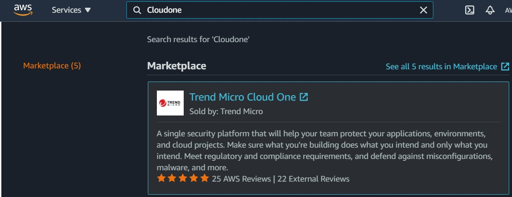
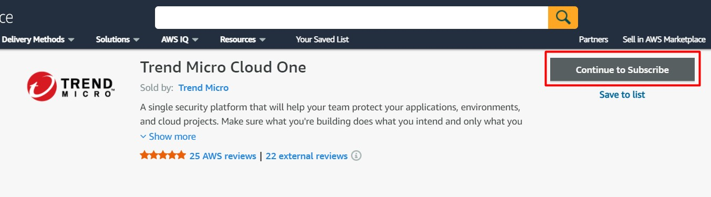
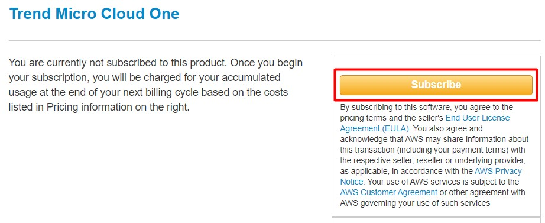
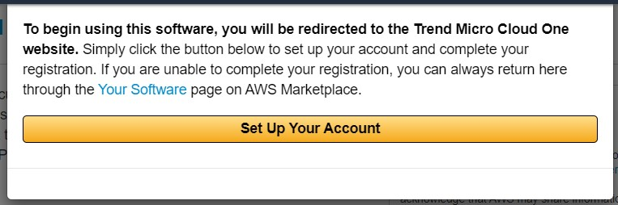
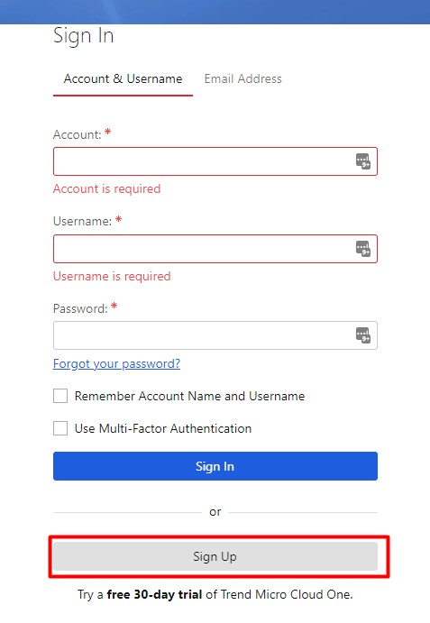

# SCA-TDC-Demo

Utilizando um cão de guarda para farejar vulnerabilidades em dependências open source

# Conceitos

# Pré-requisitos

* Uma conta no [Trend Micro Cloud One](https://cloudone.trendmicro.com/register)

* Criando uma conta no Cloud One via AWS marketplace
 </img>
 </img>
 </img>
 </img>
 </img>

# Acessando a Console

# Analisando os projetos

# Concluindo

