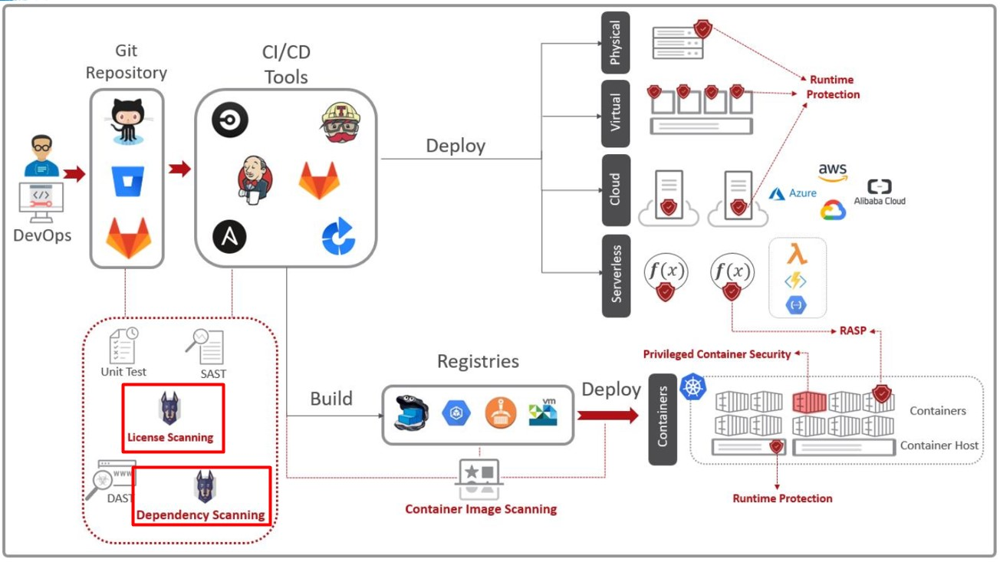
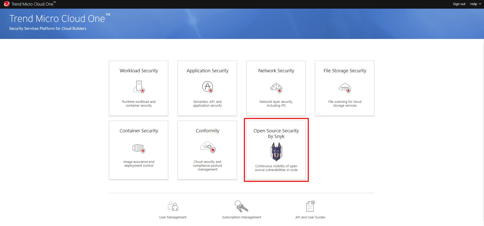

# SCA-TDC-Demo

Tema: Utilizando um cão de guarda para farejar vulnerabilidades em dependências open source

# Conceitos

Qual é o papel de uma ferramenta de SCA (Software Composition Analysis)?

Uma ferramenta SCA permite que você ganhe visibilidade de componentes de código aberto para que você possa gerenciar e mitigar quaisquer problemas de segurança, licença ou conformidade. 

Como ele analisa?

O Cloud One Open Source Security by Snyk analisa o arquivo de manifesto da aplicação listando todas as issues e informando o que precisa ser feito para resolver.

Por que isso é importante?

* Ajuda na priorizeção e remediação fornecendo alertas críticos para ajudar os desenvolvedores a corrigir problemas rapidamente, sem interrupção dos fluxos de trabalho.

* Fornece relatórios abrangentes sobre riscos de código aberto em aplicativos monotilicos e microsserviços, como bibliotecas desatualizadas ou descontinuadas além de informações sobre o a licença de uso;

O Cloud One possui um módulo chamado Open Security by Snyk que usaremos nessa demo e ele é quem faz o papel de SCA.

[Fonte](https://www.trendmicro.com/en_us/devops/21/f/software-composition-analysis-101.html)

 </img>

# Pré-requisitos

* Uma conta no [Trend Micro Cloud One](https://cloudone.trendmicro.com/register)

* É cliente AWS? Pode criar a conta no Cloud One via AWS Marketplace

 </img>
 </img>
 </img>
 </img>
 </img>

# Acessando a Console

 </img>

# Analisando os projetos

Iremos anaisar dois projetos em linguagens diferentes :)

1º Projeto

```
$ git clone https://sa-saopaulo-1.ocir.io
username: tenancy-namespace>/oracleidentitycloudservice/<username
password: inserir-token
Login Succeeded
```

2º Projeto

```
$ docker login https://sa-saopaulo-1.ocir.io
username: tenancy-namespace>/oracleidentitycloudservice/<username
password: inserir-token
Login Succeeded
```

# Concluindo


