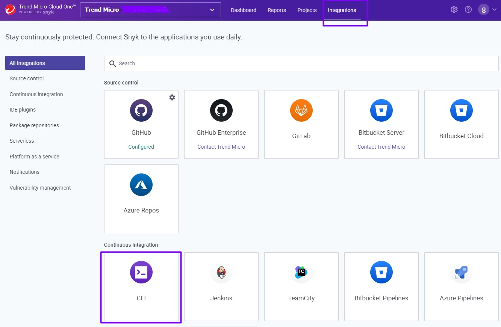
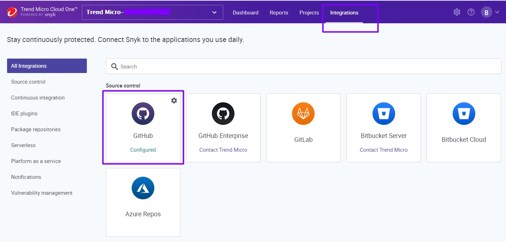

# SCA-TDC-Demo

Tema: Utilizando um cão de guarda para farejar vulnerabilidades em dependências open source

# Conceitos

Qual é o papel de uma ferramenta de SCA (Software Composition Analysis)?

Uma ferramenta SCA permite que você ganhe visibilidade de componentes de código aberto para que você possa gerenciar e mitigar quaisquer problemas de segurança, licença ou conformidade. 

Como ele analisa?

O Cloud One Open Source Security by Snyk analisa o arquivo de manifesto da aplicação listando todas as issues e informando o que precisa ser feito para resolver.

Por que isso é importante?

* Ajuda na priorizeção e remediação fornecendo alertas críticos para ajudar os desenvolvedores a corrigir problemas rapidamente, sem interrupção dos fluxos de trabalho.

* Fornece relatórios abrangentes sobre riscos de código aberto em aplicativos monotilicos e microsserviços, como bibliotecas desatualizadas ou descontinuadas além de informações sobre o a licença de uso;

O Cloud One possui um módulo chamado Open Security by Snyk que usaremos nessa demo e ele é quem faz o papel de SCA.

[Fonte](https://www.trendmicro.com/en_us/devops/21/f/software-composition-analysis-101.html)

 </img>

# Pré-requisitos

* Uma conta no [Trend Micro Cloud One](https://cloudone.trendmicro.com/register)

* É cliente AWS? Pode criar a conta no Cloud One via AWS Marketplace

 </img>
 </img>
 </img>
 </img>
 </img>

# Acessando a Console

 </img>

# Analisando os projetos

Iremos anaisar dois projetos de formas diferentes :)

1º Projeto via Snyk cli 

 </img>

```
$ git clone https://github.com/SecurityForCloudBuilders/Protect-a-Vulnerable-WebApplication
$ cd HeadPage-Demo-App-Protect-RASP
$ snyk test (resultados nos shell)
$ snyk monitor (link com resultado do scan na console)
```

2º Importando projetos do Github

Acess a console do Cloud One, clique em Open Source Security by Snyk

 </img>

Selecione Github > forneça acessos a repos publicos/privados ou somente públicos > autorize para acessar o repo > selecione o projeto que deseja analisar :)

# Concluindo

Construir um software não é para qualquer um principalmente lidando com várias equipes e pessoas com temperamentos diferentes!

Tão breve conseguirmos resolver problemas relacionados a segurança mais estável e menos paradas emergenciais teremos em nossa aplicação.

Mais informações sobre como como desenvolver se forma segurança clica [aqui](https://www.trendmicro.com/en_us/devops.html)

Ficou com dúvida? Só dar um toque :)
